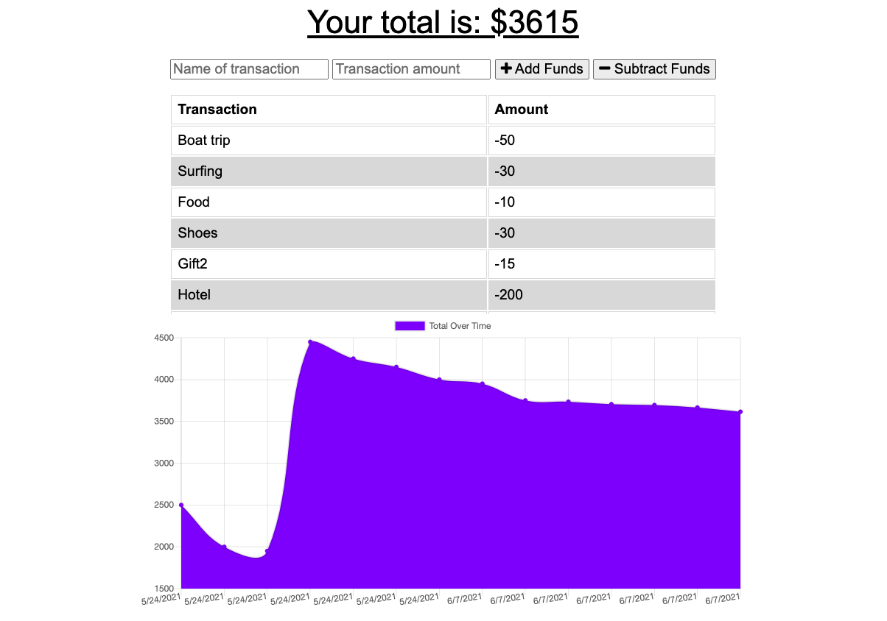
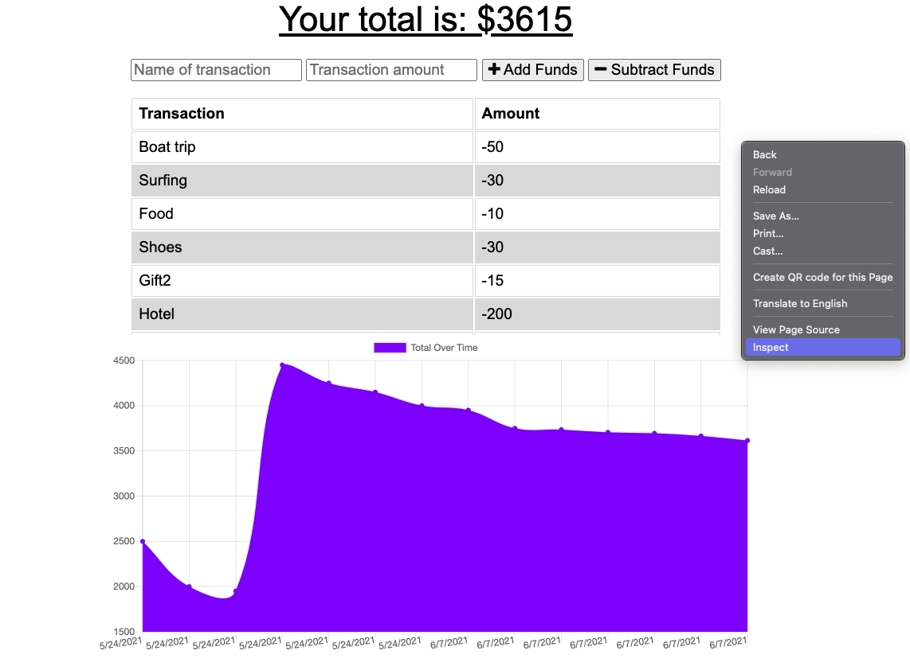
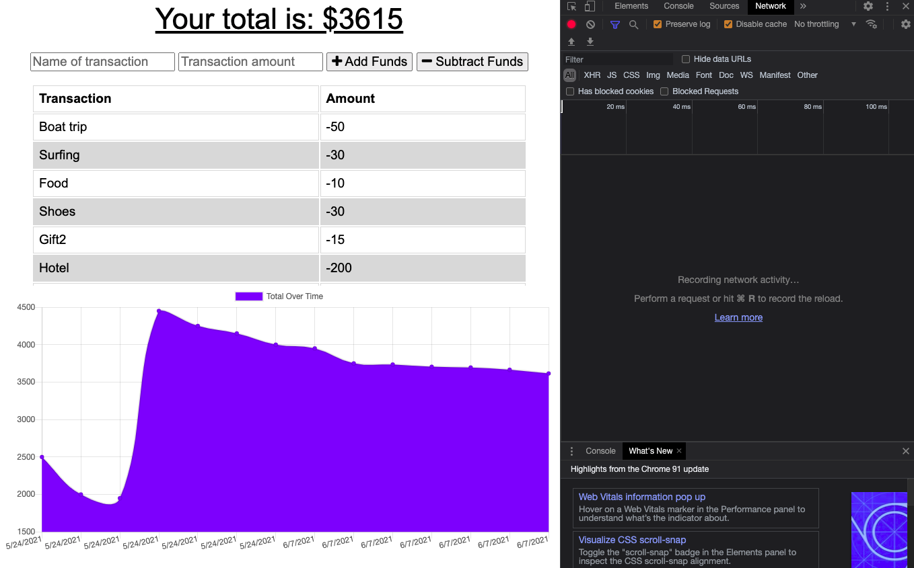
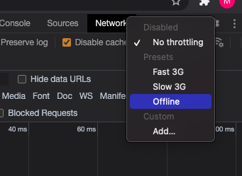
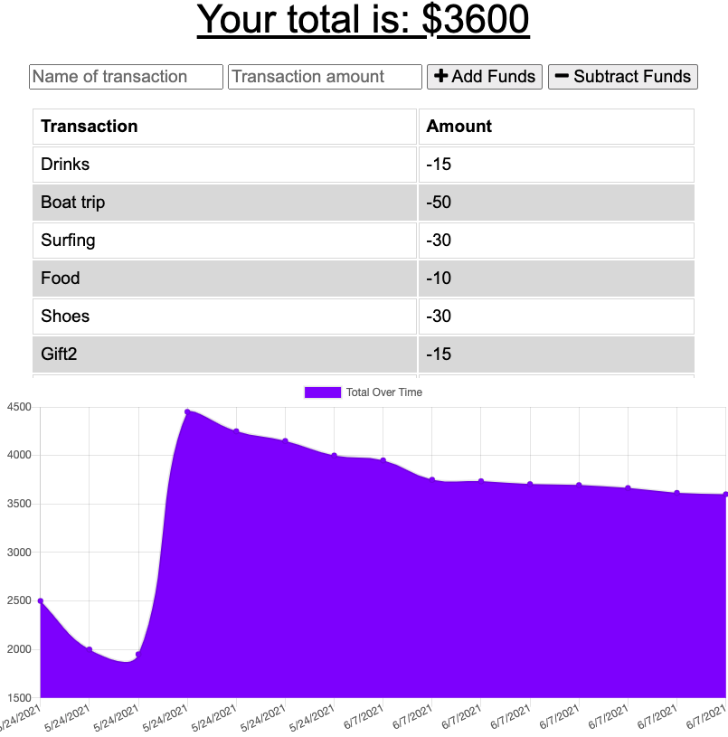
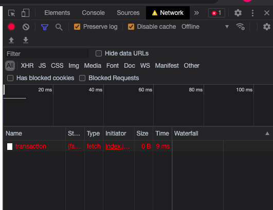
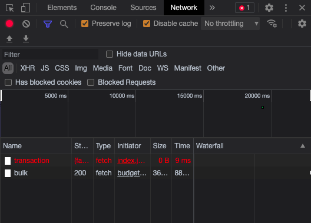

# BudgetTracker

## User Story
AS AN avid traveller
I WANT to be able to track my withdrawals and deposits with or without a data/internet connection
SO THAT my account balance is accurate when I am traveling

## Business Context

Giving users a fast and easy way to track their money is important, but allowing them to access that information anytime is even more important. Having offline functionality is paramount to our applications success.

## Acceptance Criteria
GIVEN a user is on Budget App without an internet connection
WHEN the user inputs a withdrawal or deposit
THEN that will be shown on the page, and added to their transaction history when their connection is back online.

## Access
Link to app: https://sheltered-eyrie-92066.herokuapp.com/ 

## How to use
1. Open the app

2. Open chrome dev tools by right clicking the app and selecting 'Inspect' from the menu

3. Go to the network tab in chrome dev tools

4. In the 'No throttling' drop-down select 'Offline'  

5. Add a new expense

6. You should see a new transaction in the network tab (it will be red)

7. Go back online by selecting the 'No throttling' from the drop-down  
8. A bulk transaction should appear in the Network tab  

